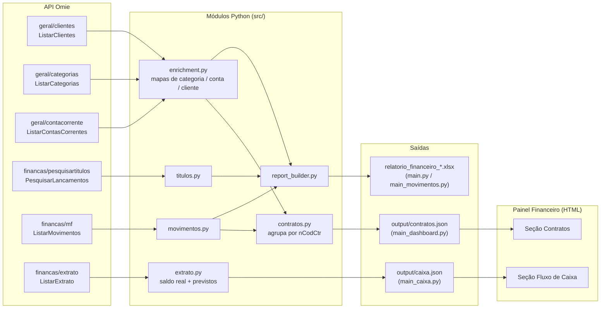

# Glossário — Variáveis, Endpoints e Fluxo de Dados

Referência de onde cada dado vem (endpoint da Omie), o que cada campo significa,
e como eles se combinam para gerar os relatórios Excel e os dois painéis HTML
(Fluxo de Caixa e Contratos). Gerado a partir do código em `src/` — reflete
exatamente o que está implementado, não a documentação da Omie.

## 1. Endpoints usados

| Módulo Omie | Chamada | Arquivo que consome | Usado para |
|---|---|---|---|
| `geral/clientes` | `ListarClientes` | `enrichment.py` | Cadastro de clientes/fornecedores (razão social, nome fantasia, CNPJ/CPF) |
| `geral/categorias` | `ListarCategorias` | `enrichment.py` | Categorias financeiras (descrição, grupo, vínculo com DRE, se está inativa) |
| `geral/contacorrente` | `ListarContasCorrentes` | `enrichment.py` | Cadastro das contas correntes (nome do banco) |
| `financas/pesquisartitulos` | `PesquisarLancamentos` | `titulos.py` | Títulos lançados (contas a pagar/receber) — fonte usada por `main.py` |
| `financas/mf` | `ListarMovimentos` | `movimentos.py` (e, por consequência, `contratos.py`) | Títulos lançados **+ previsões futuras de contrato** — fonte usada por `main_movimentos.py` e `main_dashboard.py` |
| `financas/extrato` | `ListarExtrato` | `extrato.py` | Saldo da conta corrente (saldo do dia anterior) + lançamentos previstos — fonte usada por `main_caixa.py` |

`PesquisarLancamentos` e `ListarMovimentos` são duas fontes alternativas para o
mesmo tipo de dado (títulos); só `ListarMovimentos` traz previsão de contrato
(`PREVISAO_CONTRATO`), por isso os painéis (`contratos.py`, `extrato.py`)
dependem dele, não do `PesquisarLancamentos`.

## 2. Diagrama — da API aos painéis

## 3. Glossário de variáveis

### 3.1 Parâmetros comuns de requisição

| Campo | Onde aparece | Significado |
|---|---|---|
| `nPagina` / `pagina` | todas as listagens | Página atual (paginação da Omie) |
| `nRegPorPagina` / `registros_por_pagina` | todas as listagens | Registros por página (limite documentado: 100) |
| `cNatureza` | `PesquisarLancamentos`, `ListarMovimentos` | Natureza do título: `P` = a pagar, `R` = a receber |
| `dDtVencDe` / `dDtVencAte` | filtro por vencimento | Intervalo de datas de vencimento (`dd/mm/aaaa`) |
| `dDtEmisDe` / `dDtEmisAte` | filtro por emissão | Intervalo de datas de emissão |
| `dDtPagtoDe` / `dDtPagtoAte` | filtro por pagamento | Intervalo de datas de pagamento |
| `cStatus` | filtro por status | Status do título (vocabulário difere entre os dois endpoints — ver 3.3) |
| `lDadosCad` | só `ListarMovimentos` | Se `true`, recupera também a observação do título (sem isso, some em ~70% dos casos) |
| `dPeriodoInicial` / `dPeriodoFinal` | só `ListarExtrato` | Intervalo do extrato (`dd/mm/aaaa`) |

### 3.2 Título (`cabecTitulo` + `resumo`)

Estrutura comum a `PesquisarLancamentos` e `ListarMovimentos` — cada título tem
um `cabecTitulo` (dados cadastrais) e um `resumo` (valores).

| Campo | Bloco | Significado |
|---|---|---|
| `nCodTitulo` | cabecTitulo | Código único do título na Omie |
| `cCodIntTitulo` | cabecTitulo | Código de integração (se o título veio de outro sistema) |
| `cNumTitulo` | cabecTitulo | Número do título (ex.: número da nota fiscal) |
| `cNumParcela` | cabecTitulo | Parcela (ex.: `"003/010"`) |
| `nCodCliente` | cabecTitulo | Código do cliente/fornecedor — chave pro mapa de clientes (3.4) |
| `cCPFCNPJCliente` | cabecTitulo | CNPJ/CPF do cliente/fornecedor (fallback quando o cadastro não retorna) |
| `cCodCateg` | cabecTitulo | Código da categoria financeira — chave pro mapa de categorias (3.4) |
| `nCodCC` | cabecTitulo | Código da conta corrente — chave pro mapa de contas (3.4) |
| `nCodCtr` | cabecTitulo | Código do contrato — só presente quando o título nasceu de um contrato formal; é a chave que `contratos.py` usa pra agrupar parcelas |
| `cNumDocFiscal` | cabecTitulo | Número do documento fiscal |
| `cTipo` | cabecTitulo | Tipo de documento (ex.: `NF`, `BOL`) |
| `dDtEmissao` / `dDtVenc` / `dDtPagamento` / `dDtRegistro` | cabecTitulo | Datas de emissão, vencimento, pagamento e registro |
| `cStatus` | cabecTitulo | Status bruto da Omie (vocabulário em 3.3) |
| `nValorTitulo` | cabecTitulo | Valor cheio do título |
| `nValorCOFINS` / `CSLL` / `INSS` / `IR` / `ISS` / `PIS` | cabecTitulo | Valor calculado de cada retenção |
| `cRetCOFINS` / `CSLL` / `INSS` / `IR` / `ISS` / `PIS` | cabecTitulo | Flag (`"S"`/`"N"`) se a retenção **de fato** se aplica — `nValorXXX` pode vir preenchido mesmo com a retenção desativada; o relatório só considera o valor quando o flag não é `"N"` |
| `observacao` | cabecTitulo | Texto livre; pode conter `\|` (trocado por espaço) e entidades HTML (`&amp;`) |
| `cLiquidado` | resumo | `"S"`/`"N"` — se o título já foi baixado |
| `nValPago` | resumo | Valor efetivamente pago/recebido |
| `nValAberto` | resumo | Valor ainda em aberto |
| `nJuros` / `nMulta` / `nDesconto` | resumo | Encargos e desconto aplicados |
| `nValLiquido` | resumo | Valor líquido (título − desconto + juros + multa) |

### 3.3 Só do `ListarMovimentos`

| Campo | Significado |
|---|---|
| `cGrupo` | Tipo de registro dentro do extrato de movimentos: `CONTA_A_PAGAR`, `CONTA_A_RECEBER` (títulos de verdade), `PREVISAO_CONTRATO` (previsão de faturamento, ainda não é título), `CONTA_CORRENTE_PAG`/`CONTA_CORRENTE_REC` (baixa bancária do título — **descartados** pelo código pra não duplicar valor pago) |
| `cStatus` (vocabulário) | `A VENCER`, `VENCE HOJE`, `PAGO`, `RECEBIDO`, `ATRASADO`, `CANCELADO`, `PREVISAO` — diferente do vocabulário do `PesquisarLancamentos` (`EMABERTO`, `LIQUIDADO`, etc.) |

### 3.4 Cadastros (`enrichment.py`)

| Campo | Endpoint | Significado |
|---|---|---|
| `codigo` | ListarCategorias | Código da categoria (chave do mapa) |
| `descricao` | Categorias / Contas / Clientes | Nome de exibição |
| `categoria_superior` | ListarCategorias | Código do grupo (categoria "pai") — resolve a coluna "Grupo" |
| `codigo_dre` | ListarCategorias | Código de vínculo no DRE — usado (junto com outras flags) pra resolver a coluna "DRE" |
| `conta_inativa` | ListarCategorias | `"S"`/`"N"` — categoria desativada; adiciona o sufixo "(inativa)" |
| `nao_exibir` / `transferencia` / `totalizadora` | ListarCategorias | Flags que, junto com o status "ATRASADO" do título, determinam a coluna "DRE" = "Não" |
| `nCodCC` | ListarContasCorrentes | Código da conta corrente (chave do mapa) |
| `codigo_cliente_omie` | ListarClientes | Código do cliente/fornecedor (chave do mapa) |
| `razao_social` / `nome_fantasia` | ListarClientes | Nome do cliente/fornecedor (nome fantasia tem prioridade na exibição) |
| `cnpj_cpf` | ListarClientes | Documento do cliente/fornecedor |

### 3.5 Extrato / Fluxo de Caixa (`extrato.py`)

| Campo | Significado |
|---|---|
| `nSaldoAnterior` | Saldo já conciliado no fechamento do dia **anterior** a `dPeriodoInicial` — consultando com `dPeriodoInicial=hoje`, é exatamente "o saldo real de hoje" |
| `nSaldoAtual` | Saldo no momento da consulta (não usado no painel) |
| `listaMovimentos` | Lista de linhas do extrato — inclui marcadores de saldo diário (`cDesCliente="SALDO"`/`"SALDO ANTERIOR"`, sem `cSituacao`) que **não** são lançamentos de verdade |
| `cSituacao` | `"Conciliado"` (já baixado) ou `"Previsto"` — **atenção**: `"Previsto"` cobre tanto o que ainda vai vencer quanto o que já venceu e segue em aberto (atrasado); por isso o código também filtra por `dDataLancamento >= hoje` pra achar só o "a vencer" de verdade |
| `dDataLancamento` | Data do lançamento |
| `nValorDocumento` | Valor do lançamento (sinal: positivo = entrada, negativo = saída) |
| `cRazCliente` / `cDesCliente` | Cliente/fornecedor do lançamento |
| `cDesCategoria` | Categoria financeira do lançamento |
| `cNatureza` | `P`/`R` (pagar/receber) |

### 3.6 Campos calculados (não vêm da Omie — são derivados pelo código)

| Campo | Onde é calculado | Significado |
|---|---|---|
| `situacao` (parcela) | `contratos.py` | Um de 6 estados: `Previsto`, `Em aberto`, `Atrasado`, `Pago no prazo`, `Pago com atraso`, `Cancelado` — deriva de `cStatus` + comparação `dDtPagamento` vs `dDtVenc` |
| `status_contrato` | `contratos.py` | Status agregado do contrato: `Em atraso` (prioridade máxima, mesmo se encerrado/cancelado) → `Ativo` (tem parcela futura) → `Cancelado` (tudo cancelado) → `Encerrado` |
| `proxima_parcela` | `contratos.py` | Parcela mais próxima entre as `Previsto`/`Em aberto`/`Atrasado` — inclui atrasadas de propósito, pra não esconder o que mais precisa de atenção |
| `valor_recorrente` | `contratos.py` | Valor da parcela mais recente não cancelada do contrato |
| `saldo_real_total` | `extrato.py` | Soma do `nSaldoAnterior` das 4 contas operacionais |
| `lancamentos_previstos` | `extrato.py` | Lançamentos com `cSituacao="Previsto"` e `dDataLancamento >= hoje` |
| `fluxo_semanal` / `saldo_previsto_acumulado` | `extrato.py` | Lançamentos previstos agrupados por semana, com saldo acumulado (`saldo_real_total` + previstos até aquela semana) |
| `Situação do Vencimento` | `report_builder.py` | Faixa de vencimento (ex.: "Vencido até 30 dias") — mesmo critério do relatório nativo da Omie |

## 4. As contas operacionais consideradas no caixa

Definidas em `extrato.py::CONTAS_ALVO`, resolvidas por nome (não por código
fixo) contra o cadastro de `ListarContasCorrentes`: são 4 contas — 2 contas
correntes principais e a respectiva conta de aplicação/investimento de cada
uma. Os nomes exatos das instituições ficam só no código (`extrato.py`), não
neste documento, já que são um dado específico do cliente, não da lógica do
projeto.

Contas de caixinha, adiantamento e outras contas auxiliares ficam de fora
propositalmente — só entram no cálculo as 4 contas operacionais.
